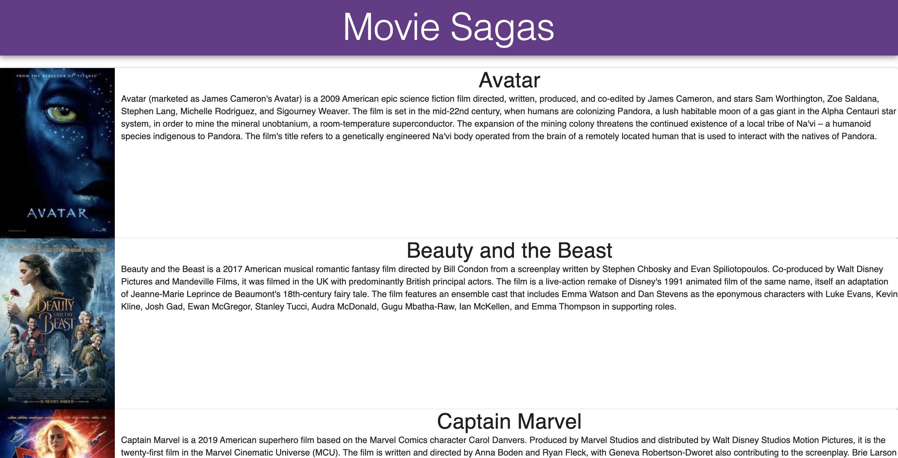
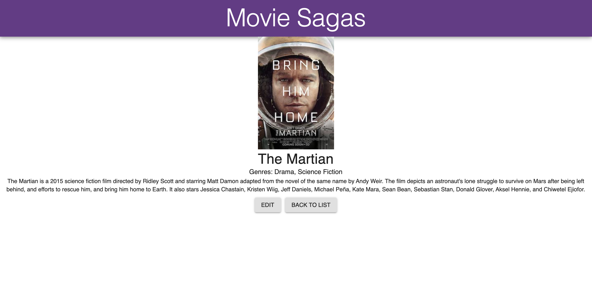
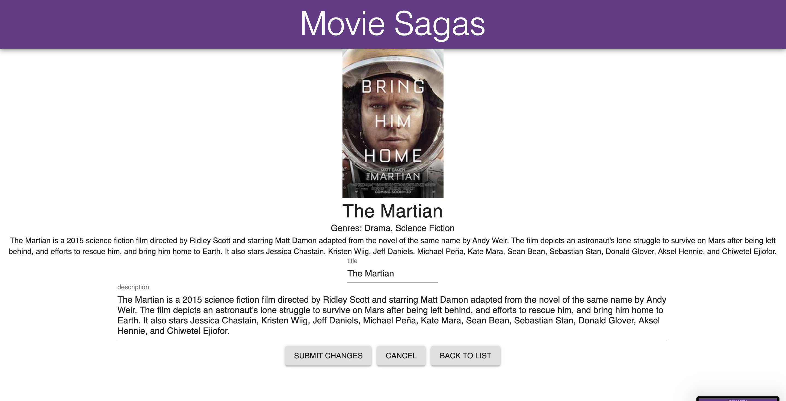

# MOVIE SAGAS

## Description

_Duration: Weekend Challenge_

This app displays movie data from a database. A list is presented to the user on the home screen displaying the movie's poster, title and description. Clicking a movie poster navigates a user to the movie's detail view which also displays that movie's genres. From the details view, users can navigate to 2 places, back to the list or to the edit view. The edit view allows a user to change a movie's title or description.

## Screen Shots

### Prerequisites

Link to software that is required to install the app (e.g. node).

- [Node.js](https://nodejs.org/en/)
- [PostgreSQL](https://www.postgresql.org/)

## Installation

1. Create a database named `saga_movies_weekend`,
2. Run the queries in `database.sql` to create your tables and populate them with sample movies and their genres
3. Navigate to this directory in your terminal
4. Run `npm install` in your terminal
5. Run `npm run server` in your terminal to start the server
6. Run `npm run client` in your terminal to start your client

## Usage

How does someone use this application? Tell a user story here.

#### Viewing:

1. Click the poster of a movie to get more details

#### Editing:

1. Click the poster of the movie you want to edit to get to it's details view.
1. Click the edit button
1. Use the input fields to change the title

## Built With

[Material-UI](https://material-ui.com/)

## License

[MIT](./LICENSE.TXT)

## Acknowledgement

Thanks to [Prime Digital Academy](www.primeacademy.io) who equipped and helped me to make this application a reality.

## Support

If you have suggestions or issues, please email me at [ccheltonap@gmail.com](mailto:ccheltonap@gmail.com)
